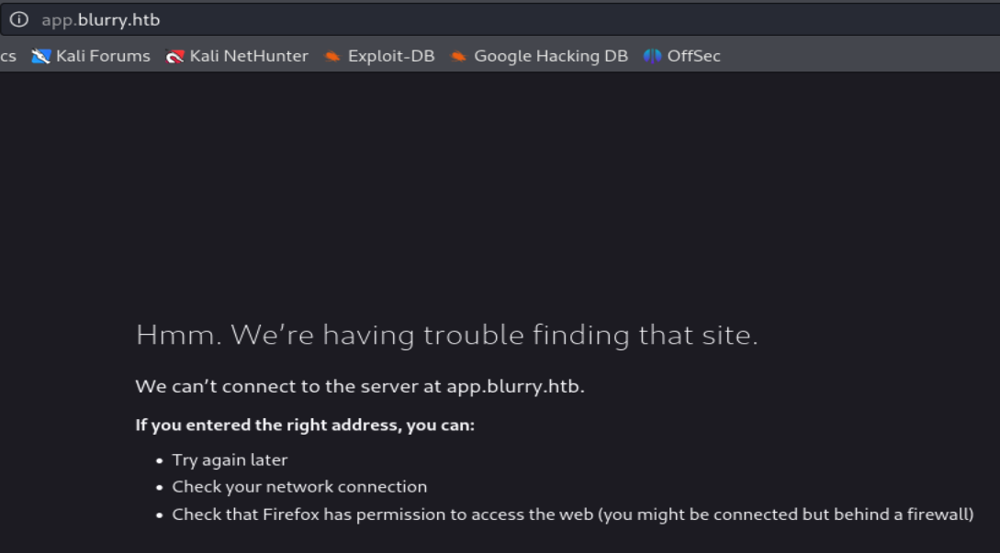

status: in progress

# blurry

First step is to run nmap on the machines IP to discover target's 

>what is nmap

I see that i discovered 2 ports, port 22 and port 80

trying to follow the port 80, it redirect us to app.blurry.htb but is not able to find the site, i need to add it to my hosts with `nano /etc/hosts`
>what is it?

and now i can see the login page of the server

i can put any username as if i were another developer using this app, im given the instructions on how to install it

after poking around i decided to install it to try to use a CVE i found on internet about this ClearML application

[CVE-2024-24590](https://github.com/h3xm4n/ClearML-vulnerability-exploit-RCE-2024-CVE-2024-24590-)

the first step is to get the creds from the app, which i already did, now i need to get the exploit and modify it with my information

