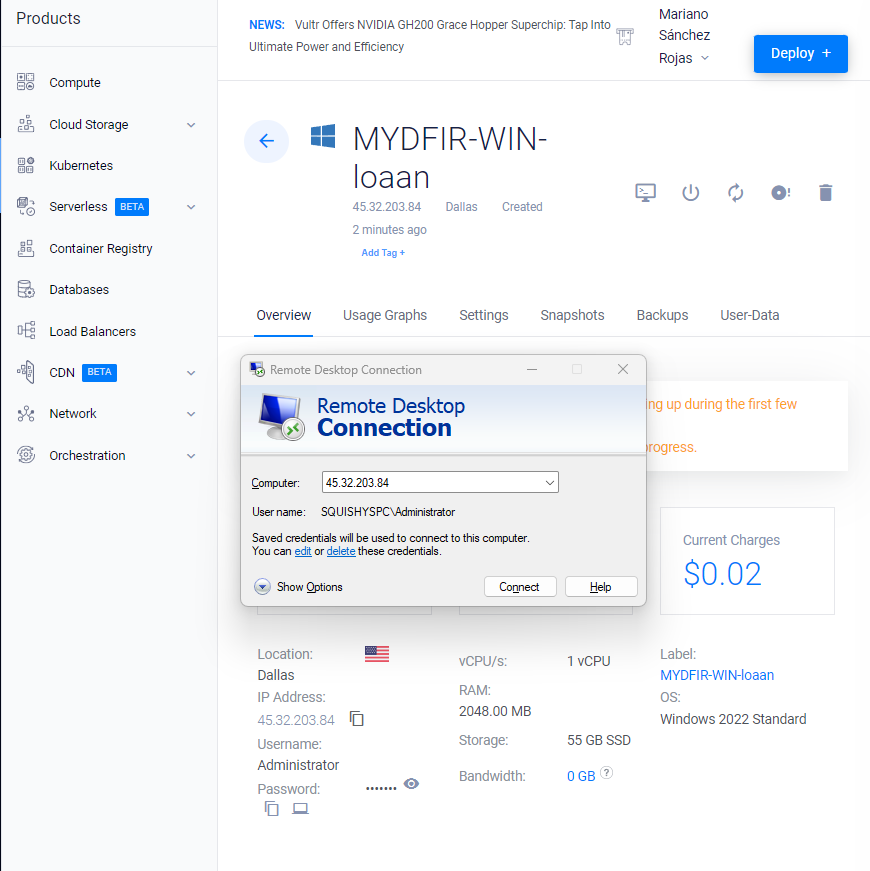

status: in progress

# ELK stack

## What is ELK stack? 

>Is an acronym used to describe a stack that compromises three projects: Elastic Search, Logstash and Kibana.

The E stands for `elasticsearch` which is a distributed search and analytics engine, allows you to store, search and analyze large amounts of data quickly. 
The L stands for `logstash`, this is an open-source data processing pipeline tool, it collects, process and forwards log data.
The K stands for `kibana`, this is a data visualization and exploration tool.

So basically `logstash` works as a delivery guy on his scooter, delivering food made by the kitchen of many restaurants (`elasticsearch`) you tell them what you want and they can prepare it really quick but it is only accessible through the desktop, which is `kibana`. Or something like that.

## Objective

Learn how to set up and configure ELK stash in the cloud, along with attacks, detection and investigation. 
Learn how to create alerts and dashboards and integrate a ticketing system.

## Hands On
So now that I have a bigger picture and better understanding, I will start the process documentation.


## Logical Diagram
The first step is creating a logical diagram. I find it funny to create it and it also allows me to visualize how the connection will work, cause sometimes it can get very abstract.


With that information we can go ahead and start the machines on the cloud and install the programs. 

## VPC creation


> unlike aws, I find VULTR very easy to use and configure

once that I easily created the VPC 2.0 in dallas, I will go ahead and spin up an ubuntu server

## ubuntu server creation


Pretty straight forward process, it will ask us about how many storage do you want, the version of the Virtual Machine _i chose ubuntu 24.04_. 


Once the server is up, we can _for practicity_ ssh from our machine to the server in the cloud.


*******

## Elasticsearch installation

Once that I spined the server up, now i will install elasticsearch using `wget` , then `dpkg -i` to install the program and save the important information we are presented to.


I need to configure elasticsearch service that I just installed with `nano elasticsearch.yml` and enabling the network connection with the IP of the machine and selecting the port. After that we can activate the elasticsearch service.


## Kibana installation

The next program to be installed is Kibana, just like the other one, we will go to the download page and use wget on the cloud server.


after that we need to configure kibana too. to do so we'll use `nano /etc/kibana/kibana.yml/` and enable server port and changing server host to our public IP


I needed to make some settings on the firewall to make my set up secure (only i can access) and we need to set up the VM as well. 


finally we can access to elasticsearch which will ask us for the enrollment token

> these steps are quite tedious since it is only connecting one program to the other one

we will generate keys from one program to connect to the other one to be able to configure and set up alerts


once our kibana service is set up, we can proceed with the next step

*****
## Windows Server installation
### (with RDP exposed to the internet)

On vultr I went ahead and deployed another server with windows the cheapest option posible


also, I did notice that, since this machine will be exposed, we don't want to have that open access to our vpc, I will not use a VPC in that machine, so I modified the logical diagram.


Once is installed, we can connect to the server with our computer through RDP



## Elastic agent and Fleet Server

The next step is set up the elastic agent and the fleet server, but what are these things? 
Basically, the agent is the one who actually collects the information from the system, and the fleet server is the centralized system to manage the agents (coordinates elastic agents / collects data)


I need to deploy another server for it to be the fleet server (the remote control for the agents), ubuntu, inside of my vpc 2.0.


On the elastic server i found the instructions to add an agent


I made the necessary adjustments for the firewall between my servers.


Also, i did some adjustments on the configuration command the elastic server is giving me, since the port we are going to use is 8220 instead of 443, and since it is a self signed certificate I needed to specify the flag `--insecure`


and after the installation is over in the windows server, i can verify the agent on the elastic server


*************

## Sysmon

### What is it? 

is a windows system utility used for monitoring and logging system activity in detail. 
runs as a background service and logs key system events, it then can be captured in the windows event log and analyzed for suspiscious activity 
-detailed information like: process creation, network connections, file creation, registry changes, dll loading, ect. 

### Installation
i connected to the widnows server through RDP and downloaded sysmon and sysmon olaf config

> what is sysmon olaf config?
> since sysmon is very powerfull and the PCs from nowadays does A LOT of things all the time to be able to function, it can log a lot of information we dont need, so in this way sysmon only tracks the really important stuff at the moment we investigate threats or forensics.


so now i just installed a new service, configurated in my Windows server, now i have to link that log data my centralized system, elastic search

*******

### Elasticsearch ingest data

going to the elasticsearch GUI server (on port 5601), i need to add an integration


and i will create 2 policies; 1 for sysmon that i just installed, and the other one for windows defender

> why from windows defender? 
> sysmon focuses on detailed system events and windows defender on malware detection and security threats. so if windows defender logs a threat, with sysmon we will have details of the environment at that moment and we can correlate information

>basically for better detection, correlation and response to potential security incidents. 


once that is installed and configured, i made sure the firewall was correctly configurated to accept communication through the port that im using to ingest the data to (9200)

after that i can make sure it's working after restarting elastic service on the windows server and verifying something is happenning with the cpu and memory usage


**********

## Brute force attack 

so what is it? so just like with the first 2 words of the name of the attack you can imagine what is it about

the attacker attempts to guess a password, encryption key or other secret information by trying all possible combinations until the correct one is found

theres actually different types of brute force attacks like: 
- simple brute force (e.g. aaaa, aaab, aaac, etc.)
- dictionary attack (pre-determined list of likely passwords)
- credential stuffing (likst of known username-password combinations like from previous data breahes)
- hybrid attack (combination of a dictionary attack and simple brute force)

i will simulate a brute force attack, that means that i will be able to know this kind of attack from both perspectives and analyze best way to defense against this attack

## Installing SSH server

after spin up a really simple ubuntu server, we can connect to it through Powershell

[sshserv](./img/sshserv.png)


once in i update the repositories

```sh
apt-get update && apt-get upgrade -y
```

the next step is installing elastic agent

## Elastic agent in linux server


