# SimpleS

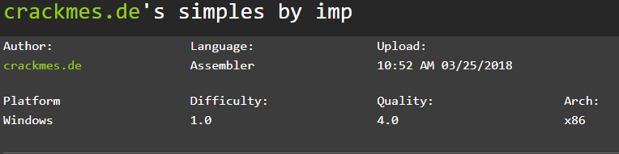

As we can see we have here a crackme, a program designed specifically to be cracked, every program will have a document telling you what you need to be considered cracked.

Since I have some information, I will run the program on my windows malware dev VM, which is isolated and set up with FlareVM for malware analysis.

## Program Working

These program only tell us to do something, does not accept any input at least what it seems from the top. 

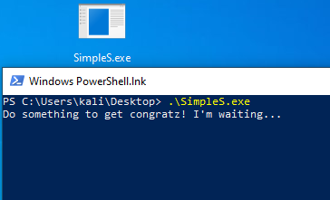

So now that we know that it's expecting something we can go ahead and start to analyze it.

## Analysis

I started with PE-Bear, which is a tool used for reverse engineer and analyze PE (Portable Executables)

> Reverse Engineer, as I understand it, is the process of breaking down software, hardware or other systems into their components to understan how they work and how they interact with each other and with the system.

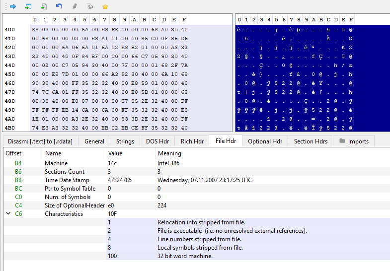

From PEBear I could see this is a 32-bit program so my next step is to open a debugger.

> What is debugging? 
>
> The process of identifying, analyzing and fixing bugs or defects in software. It is not like we want to fix a program a bad actor made, but the debuggers let us set break points so we can see how the program works step by step, if we want to get congrats, we need to see what the program does to acomplish that.

The next program I will use is x32dbg.

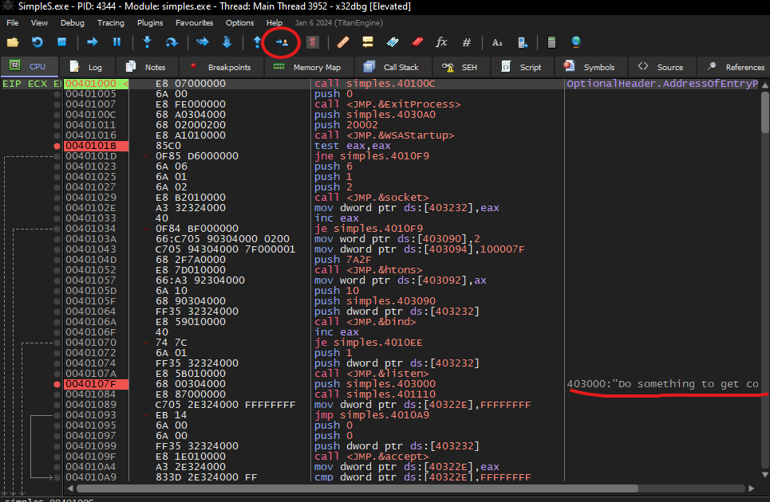

All those weird words and numbers is called assembly lenguage, which is basically how the program is interacting with the system, the memory and what information it might be using. 

The first here, is start from the beginning, the entry point, where the program starts to execute.

As I'm a beginner, I usually search all the functions that I get to identify.

After the entry point I see a function being called, I will investigate that.

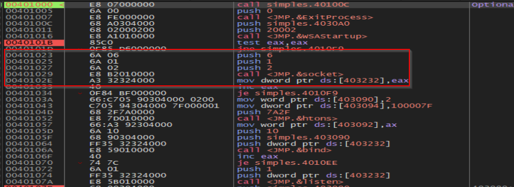

Now I need to investigate what the [socket](https://learn.microsoft.com/en-us/windows/win32/api/winsock2/nf-winsock2-socket) function does.

    Socket might be using the parameters:

    2: address family (indicating IPv4)

    1: type of socket (TCP)

    6: protocol to be used (protocol for TCP)

    socket: it seems that this function is creating new socket

    saving the descriptor to the memory address at 403232

We may have an idea what this program is doing, lets go to the next instruction.

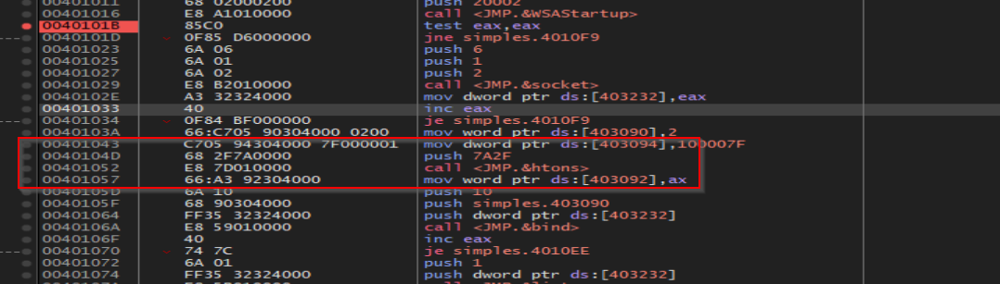

I see another function called [htons](https://learn.microsoft.com/en-us/windows/win32/api/winsock/nf-winsock-htons), just like the other one, I will search  _function_ + msdn. 

    htons might be using the parameters: 

    7A2F: 16-bit value (this could represent a port number)
    htons function seems to be preparing the value to be used in network operations
    and saves the returned value to 403090

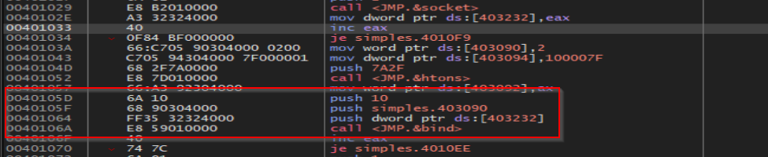

Now that we have an idea of what the program is trying to do so far, lets continue with the other function which seems to be [bind](https://learn.microsoft.com/en-us/windows/win32/api/winsock/nf-winsock-bind).

> bind function might be using the parameters: 
>
> 10:  The length, in bytes, of the value pointed to by addr (16 in decimal)
> simples.403090: sockaddr structure which is 2, the address family for IPv4
> 403232: descriptor identifying unbound socket returned by htons

So now we have identified 3 functions that used together basically the program is preparing the necessary arguments to bind a socket to an specific IP address and port on the local machine.

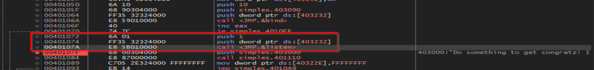

The next instruction is [listen](https://learn.microsoft.com/en-us/windows/win32/api/winsock2/nf-winsock2-listen)

> listen function using the parameters: 
>
> 403232: descriptor identifying unbound socket returned by htons
> 1: backlog value - maximum number of pending connections that can be queued before the server starts rejecting new connection attempts

This function prepares the socket to accept incoming connection requests, identified by the descriptor - binds a socket to an address and port.

If you look closely, after that instruction we see the prompt that is our turn to do something, since the program is already set up and listening to connections. 

We still dont have the crack, it seems that we need to get to _congratz!_ but how do we get there?

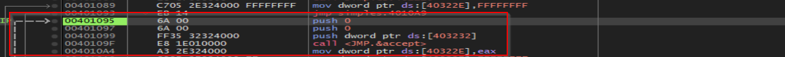

After the program tell us to do something we see another function this time is called [accept](https://learn.microsoft.com/en-us/windows/win32/api/winsock2/nf-winsock2-accept).

> accept function:
> 
> 0: address of the connecting entity, is an optional parameter, indicated by 0 not being used
> 0: size of the address, is an optional parameter, indicated by 0 not being used
> 403232: socket descriptor returned by socket
> 40322E: address on the memory where the returned value of accept will be linked.

This function is designed to accept an incoming connection on a previously created socket and returns a value that is a descriptor for new socket. 

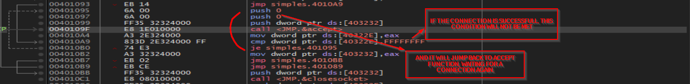

if the connection is successfull it will return a handle and will save it on 40322E
if not, the value stored in 40322E will not change and the condition will not met, and it will jump back to accept function

## Crack

### So, how do we crack this program? 

This one is very easy, with the information that we already have, we can tell that in order to get the congratz, that would mean that the program is cracked we need to make a connection to the already listening port set up by the program through tcp (we can accomplish that from our web browser)

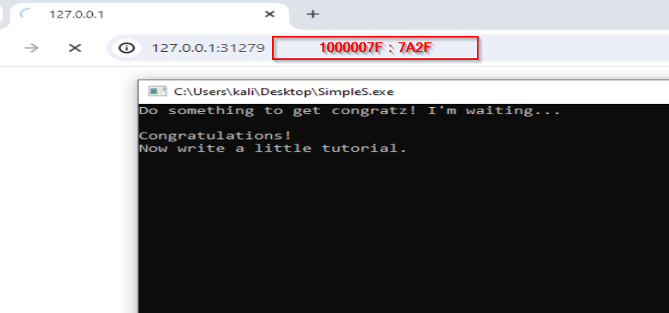
