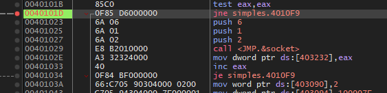

# Is this workinggggg

we search on google what the socket function does
    Socket might be using the parameters: 
    2: address family 
    1: type of socket 
    6: protocol to be used
it seems that this function is creating new socket 

    htons might be using the parameters: 
    7A2F: 16-bit value

this function prepares the 16-bit value to use in networking operations 

and then storing the return value in memory

    bind function might be using the parameters: 
    10:  The length, in bytes, of the value pointed to by addr
    simples.403090: sockaddr structure which is 2, the address family for IPv4
    403092: descriptor identifying unbound socket returned by htons

    listen function using the parameters: 

    403232: descriptor identifying unbound socket returned by socket
    1: backlog value - maximum number of pending connections that can be queued before the server starts rejecting new connection attempts

this function prepares the socket to accept incoming connection requests, identified by the descriptor - binds a socket to an address and port

    accept function: 
    0: address of the connecting entity, is an optional parameter, indicated by 0 not being used
    0: size of the address, is an optional parameter, indicated by 0 not being used
    403232: socket descriptor returned by socket

this function is designed to accept an incoming connection on a previously created socket

if the connection is successfull it will return a handle and will save it on 40322E
if not, the value stored in 40322E will not change and the condition will not met, and it will jump back to accept function