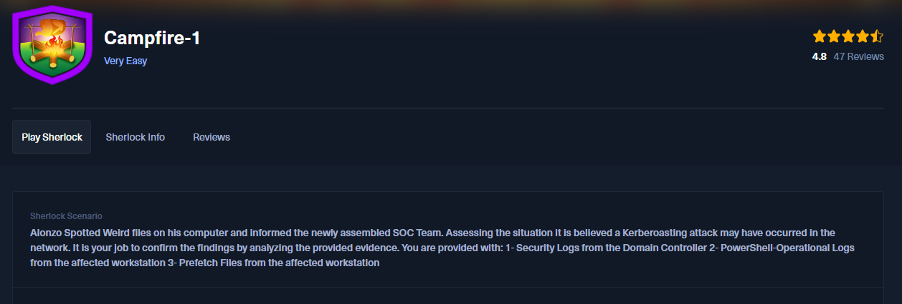
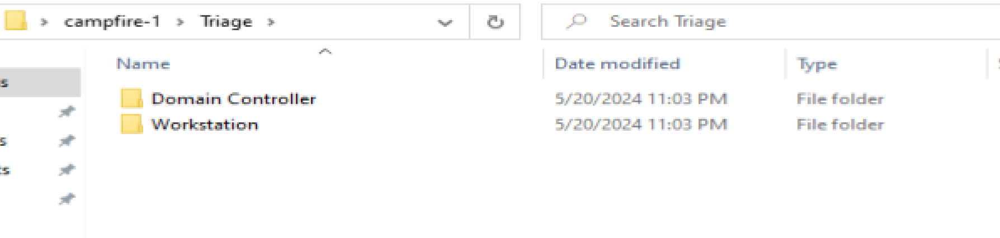
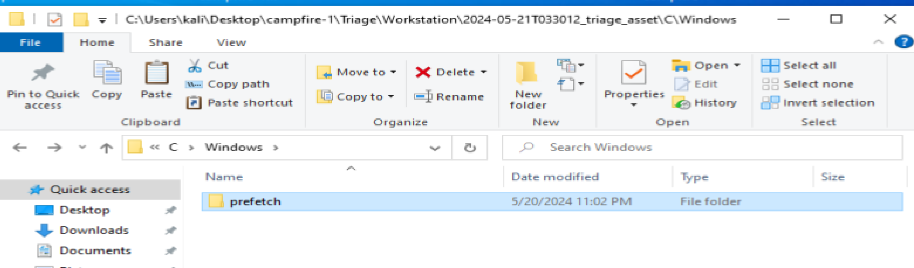
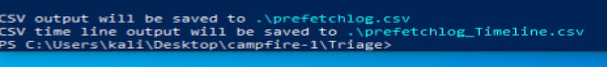
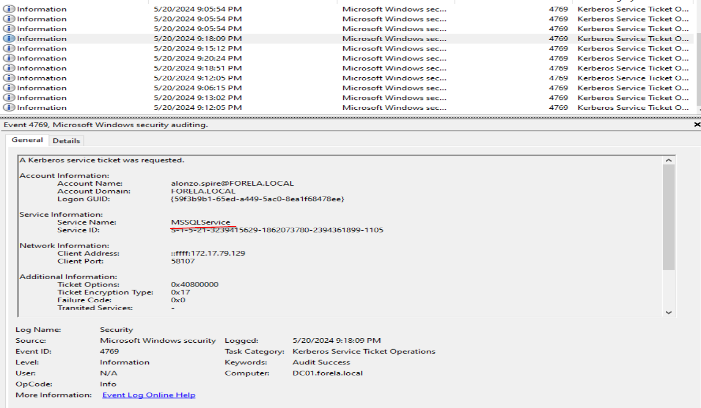
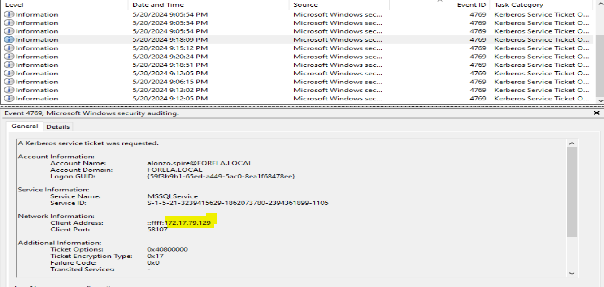
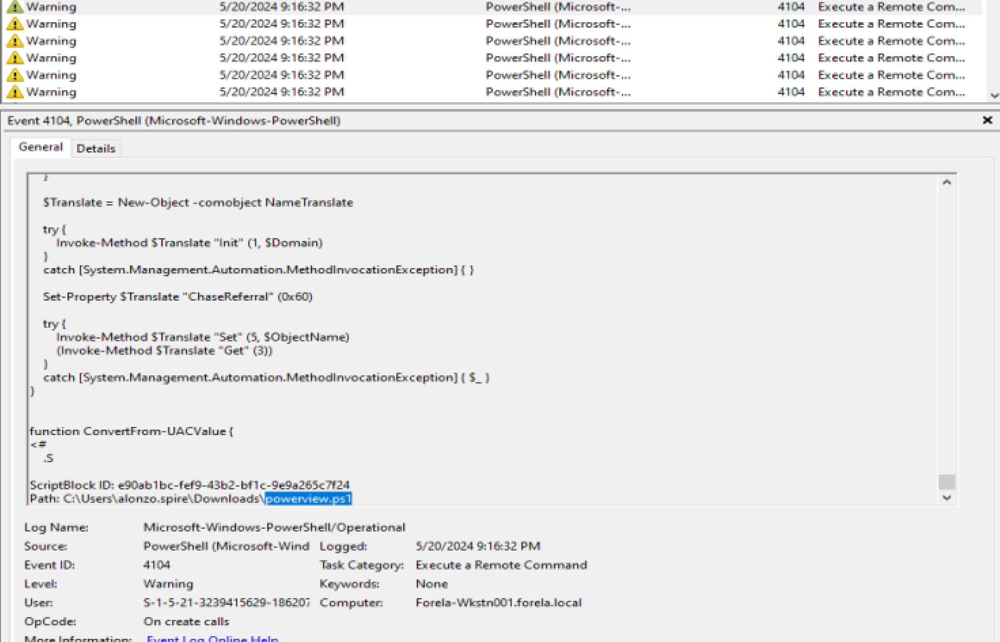
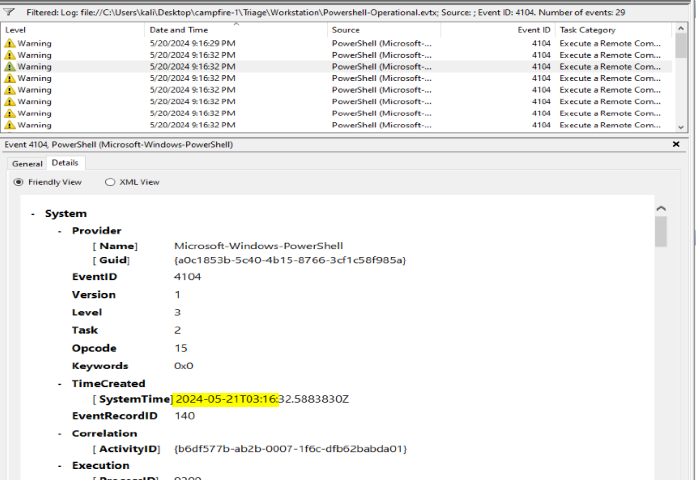
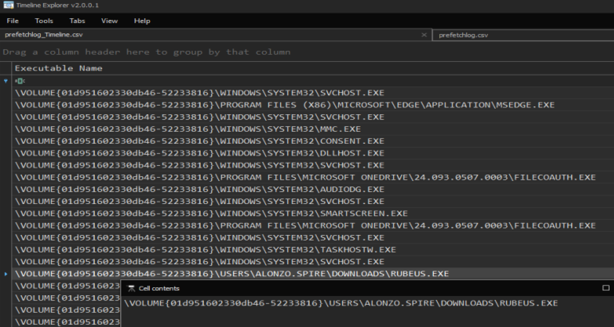
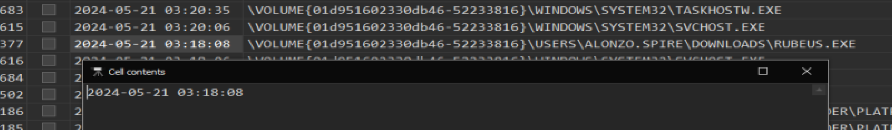

# Campfire-1



This very easy machine is a good training in digital forensics and incident response.

First, reading on the sherlock, i see that this exercise might be related to kerboroasting activities so i need to set the context here.

>Kerberos is a network authentication protocol, used to verify the identity of users in a secure way
>                                                                            
> * How it works?
>   - Login with a password
> - Get a Ticket granting service (it does not includes password)
> - Request access to services (we show TGT to the Key Distribution Center)
> - Access the service (without needing to re enter password)

>  * What is kerberoasting? 
> attack that targets kerberos authentication protocol to extract service account credential from an AD environment (like the one we have here simulated, a work environment using Active Directory)
> * How Kerberoasting works? (from attacker perspective)
> - requests service tickets 
> - captures the encrypted service ticket (encrypted with service's account password hash)
> - offline password cracking, it can be guess by brute force or dictionary attacks
> - if the password is cracked, the attacker can impersonate the service account


I see some files once that I decompress the file with 7-zip

and also some prefetch logs? 


> * What is a prefetch log? 
> - files with the  `.pf` extension created by windows to speed up the process of frequently used applications
> - it containts execution metadata (identify last time program was executed), program path, the accessed resources and execution times (last 8 times the program was used)

with PECmd.exe i converted the prefetch files in one file so i can analyze it

```sh
PECmd.exe -d "./././prefetch" --csv . --csvf outputfilename.csv`
```




## Task 1

#### Analyzing Domain Controller Security Logs, can you confirm the date & time when the kerberoasting activity occurred?

htb gives us a hint to search for the event ID 4769, but why? 
this event generates every time Key Distribution Center gets a Kerberos Ticket Granting Service ticket request. so we now that someone wanted to have access to a service, and looking closely on the event, I can see which service was targeted


## Task 2
#### What is the Service Name that was targeted?




## Task 3

#### It is really important to identify the Workstation from which this activity occurred. What is the IP Address of the workstation?



On the event i can also see the IP address of the user who requested the acces to MSSQL, maybe it failed becaused the user does not have the legitimate right to access it

## Task 4

#### Now that we have identified the workstation, a triage including PowerShell logs and Prefetch files are provided to you for some deeper insights so we can understand how this activity occurred on the endpoint. What is the name of the file used to Enumerate Active directory objects and possibly find Kerberoastable accounts in the network?



i saw a bunch of 4104 errors on the events, that error indicates us that commands were executed in powershell and all of them had the same file path

## Task 5

#### When was this script executed?




## Task 6

#### What is the full path of the tool used to perform the actual kerberoasting attack?



## Task 7

#### When was the tool executed to dump credentials?

