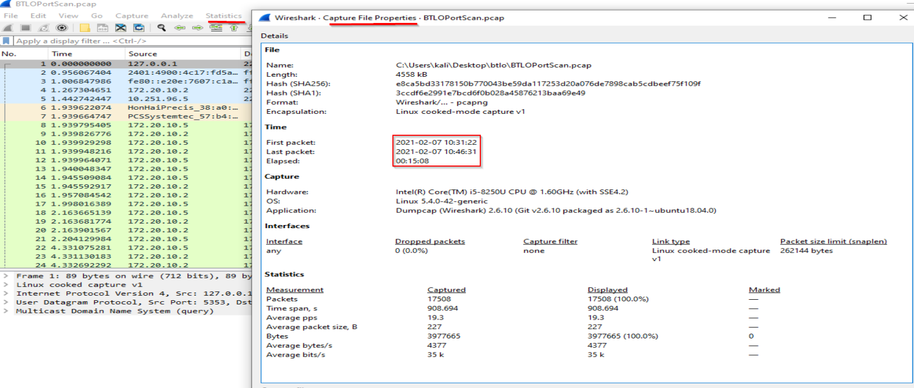
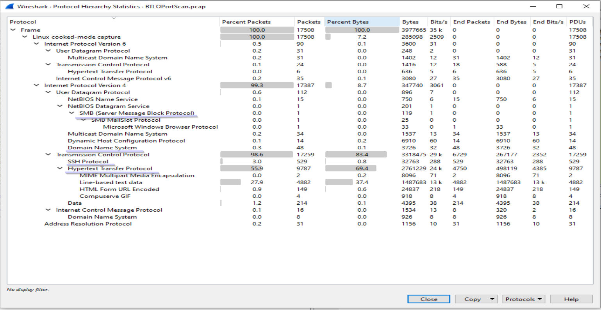

http.response.code == 200
(http.response.code == 200) && (ip.src == 10.251.96.5)
http.request.method == POST && ip.addr == 10.251.96.4

 
IP: 10.251.96.5
Username: www-data
Hostname: bob-appserver

Port Scan Activity 
Start: 2021-02-07 16:33:06 (UTC)
End: 2021-02-07 16:33:06 (UTC)
Source: 10.241.96.4:41675
Destination: 10.251.96.5 (22/80 opened)

Applications used by 10.251.96.4

App 1: gobuster 3.0.1
Start time: 2021-02-07 16:34:05
End Time: 2021-02-07 16:34:06

App 2: sqlmap 1.4.7
Start Time: 2021-02-07 16:36:17
End Time: 2021-02-07 16:37:28

Successful Web Shell Upload
Name: dbfunctions.php
Start: 2021-02-07 16:40:39
Source: 10.251.96.4
Destination: 10.251.96.5
Commandsran by 10.251.96.4 via web shell: id, whoami, python script for callback

Successful callback to 10.251.96.4:4422 via TCP reverse shell from 10.251.96.5
Start: 2021-02-07 16:42:35

Commands ran from the webserver via reverse TCP shell: bash -i, whoami, cd, ls, python & rm db

Last observed activity from 10.251.96.4 was on 2021-02-07 16:45:56

>tcp syn scan